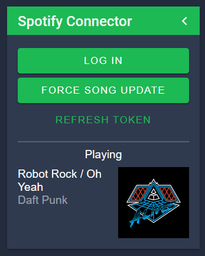

# nodecg-spotify

Forked from https://github.com/EwanLyon/ncg-spotify

<p align="center">
  
</p>

A NodeCG bundle to access the current song playing on Spotify.

## Requirements
- [NodeCG v1.x](https://github.com/nodecg/nodecg/releases)

## Installation
1. Clone (or download & extract) to `nodecg/bundles/nodecg-spotify`

2. `cd nodecg/bundles/nodecg-spotify` and run `npm install --production`

3. If [nodecg-cli](https://github.com/nodecg/nodecg-cli) is installed: run
   `nodecg defaultconfig` else go to `nodecg/cfg` and create `nodecg-spotify.json`
   and refer to [configschema.json](./configschema.json)

4. Create a Spotify app from https://developer.spotify.com/dashboard/applications

5. Click edit settings and set the redirect URI as
  `http://localhost:9090/bundles/nodecg-spotify/spotify-callback/index.html`

6. Copy the `Client ID` and `Client Secret` to the nodecg-spotify cfg in
   `nodecg/cfg/nodecg-spotify.json` in the same format as `defaultconfig.json`

7. Run the nodecg server: `node index.js` (or `nodecg start` if you have
   `nodecg-cli` installed from the `nodecg` root directory

8. Click log in on the Spotify connector panel

The token should refresh automatically but if something weird happens there is
a refresh token button.

## Usage
`nodecg-spotify` creates the Replicant `currentSong`.

To access it make a Replicant like `const song = nodecg.Replicant('currentSong', 'nodecg-spotify');`

### `currentSong` properties

- `name` String - Name of the song
- `artist` String - Name of the artists
- `albumArt` String - URL of the album art, local files will not show album art
- `playing` Boolean - True if the song is currently playing

### Example

```js
const songRep = nodecg.Replicant('currentSong', 'nodecg-spotify');

songRep.on('change', (newVal, oldVal) => {
  songNameElement.innerHTML = newVal.name;
  artistElement.innerHTML = newVal.artist;
  albumImageElement.src = newVal.albumArt;
});
```

## Contributing
Pull requests are welcome. For major changes, please open an issue first to
discuss what you would like to change.

## License
[MIT](https://choosealicense.com/licenses/mit/)
